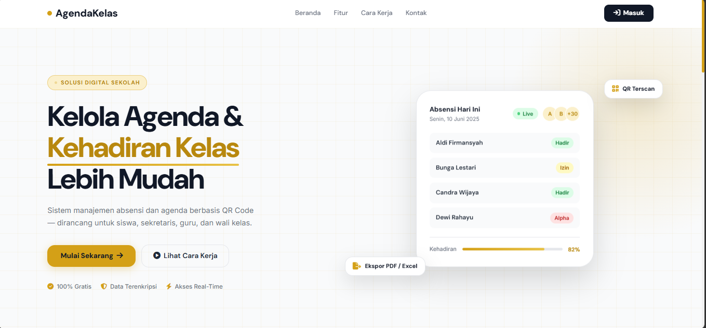
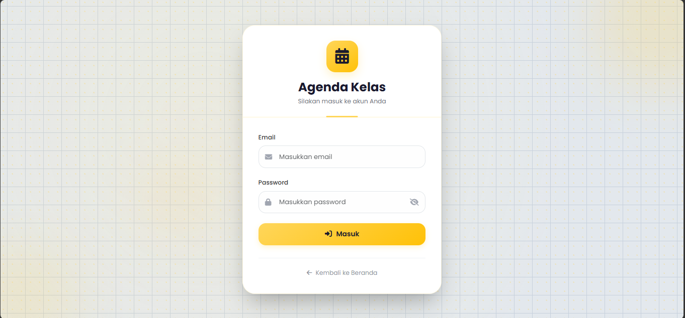
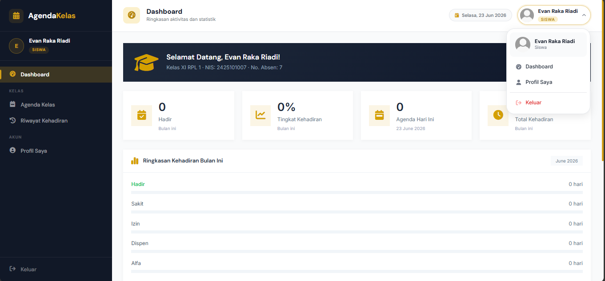
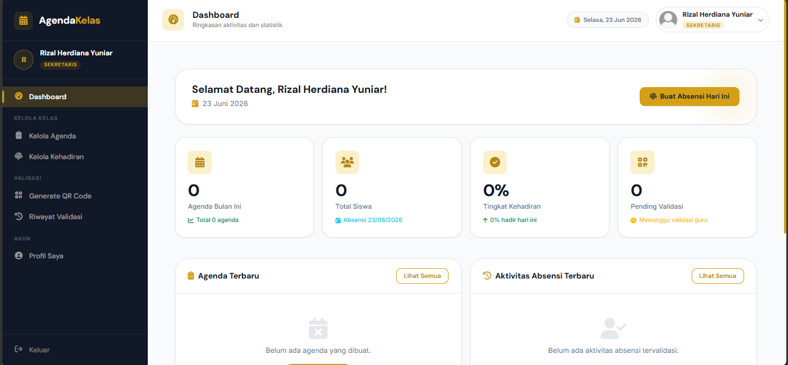
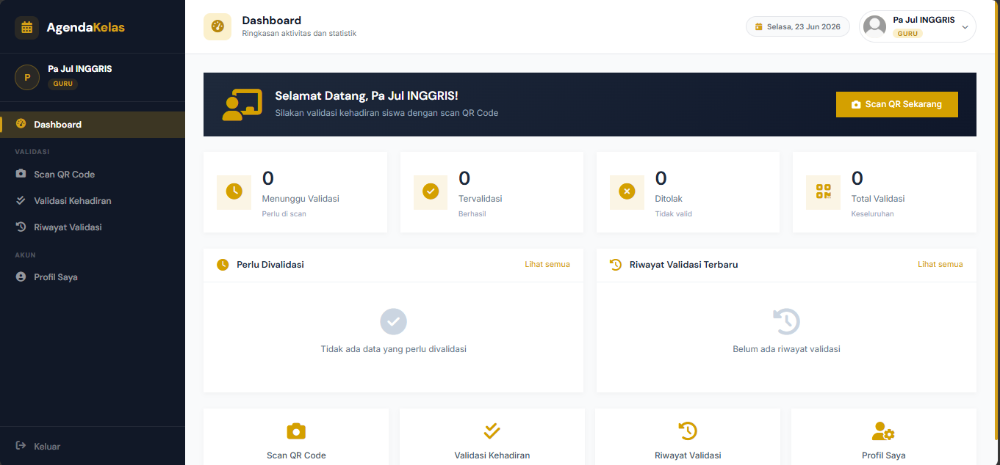
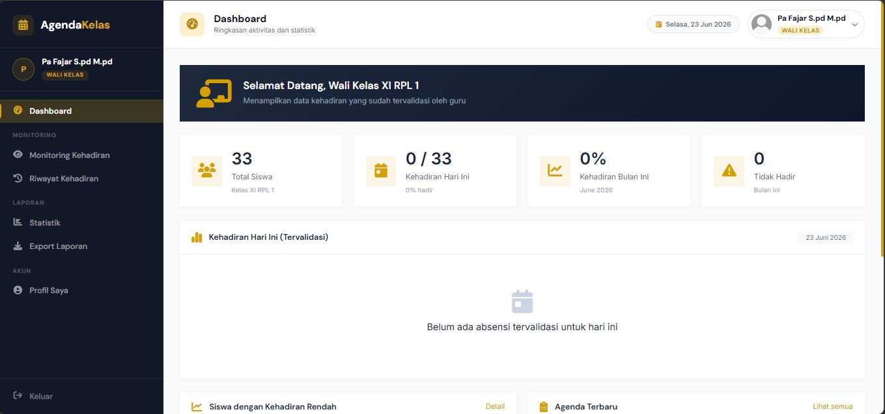
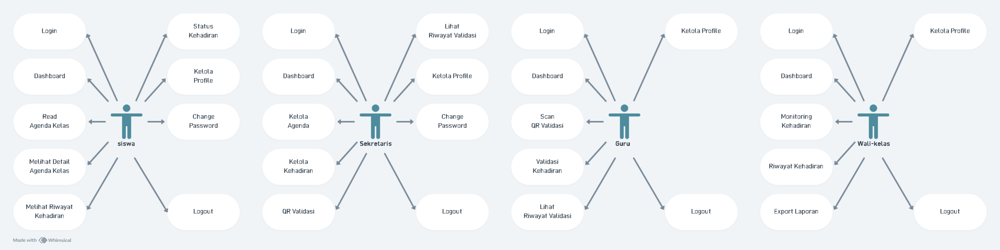
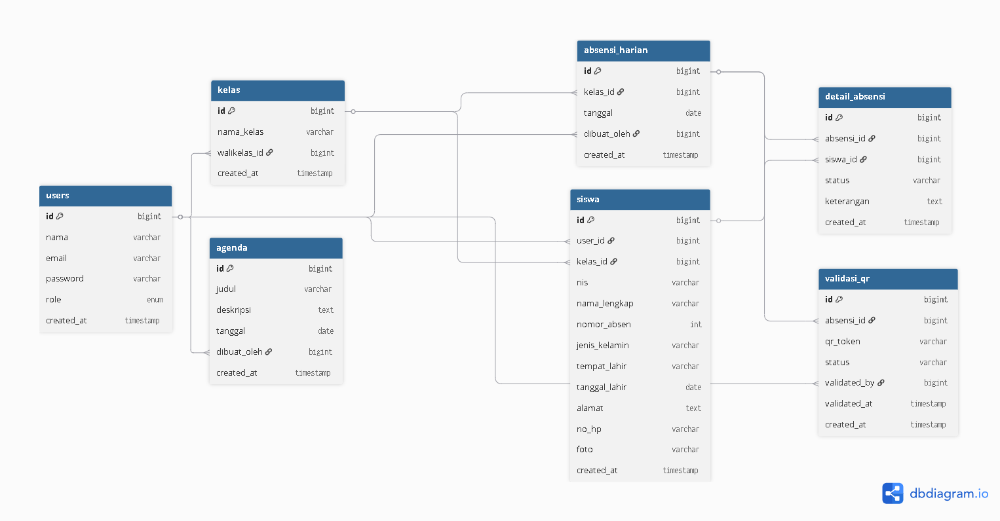

# 📚 Agenda Kelas System

Sistem manajemen agenda dan kehadiran kelas berbasis web yang dirancang untuk membantu proses pencatatan agenda pembelajaran, monitoring kehadiran, validasi guru, serta pengawasan wali kelas dalam satu platform terintegrasi.

Project ini dikembangkan menggunakan **PHP Native**, **MySQL**, **HTML**, **CSS**, dan **JavaScript** dengan arsitektur multi-role.

---

## 📖 Deskripsi

Agenda Kelas System memungkinkan siswa, sekretaris kelas, guru, dan wali kelas untuk mengelola aktivitas kelas secara digital.

Fitur utama meliputi:

- Pencatatan agenda pembelajaran
- Monitoring kehadiran siswa
- Validasi agenda oleh guru
- Dashboard sesuai role pengguna
- QR Code untuk absensi
- Statistik kehadiran
- Export data monitoring
- Riwayat aktivitas pengguna

---

## 👥 User Roles

### 🎓 Siswa
- Melihat agenda kelas
- Melihat detail agenda
- Melihat riwayat kehadiran
- Mengelola profil akun

### 📝 Sekretaris
- Menambah agenda kelas
- Mengedit agenda
- Mengelola absensi
- Generate QR Code kehadiran
- Monitoring validasi guru
- Mengelola profil akun

### 👨‍🏫 Guru
- Validasi agenda kelas
- Scan QR kehadiran
- Melihat riwayat validasi
- Mengelola profil akun

### 👨‍💼 Wali Kelas
- Monitoring agenda kelas
- Monitoring kehadiran siswa
- Melihat statistik kehadiran
- Export laporan
- Mengelola profil akun

---

# ✨ Features

## Authentication System
- Login multi-role
- Session management
- Role-based access control
- Logout system

## Agenda Management
- Tambah agenda
- Edit agenda
- Detail agenda
- Riwayat agenda

## Attendance Management
- QR Code attendance
- Attendance validation
- Attendance history
- Attendance monitoring

## Dashboard Analytics
- Statistik agenda
- Statistik kehadiran
- Monitoring aktivitas

## Report System
- Export laporan
- Monitoring data kelas

---

# 🛠️ Technology Stack

### Backend
- PHP Native

### Database
- MySQL

### Frontend
- HTML5
- CSS3
- JavaScript

### Tools
- XAMPP
- Git
- GitHub

---

# 📂 Project Structure

```bash
agenda-kelas-system
│
├── agenda-kelas/
│   │
│   ├── assets/
│   │   ├── css/
│   │   ├── img/
│   │   └── js/
│   │
│   ├── config/
│   │   ├── database.php
│   │   └── session.php
│   │
│   ├── includes/
│   │   ├── auth.php
│   │   ├── navbar.php
│   │   ├── sidebar.php
│   │   ├── footer.php
│   │   └── functions.php
│   │
│   ├── siswa/
│   ├── sekre/
│   ├── guru/
│   ├── walikelas/
│   │
│   ├── login.php
│   ├── logout.php
│   └── index.php
│
├── docs/
├── mysql/
├── usecase.png
├── erd-final.png
├── penjelasan.txt
└── flow&struktur-file.txt
```

---

# 🖼️ System Preview

## Landing Page



---

## Login Page



---

## Dashboard Siswa



---

## Dashboard Sekretaris



---

## Dashboard Guru



---

## Dashboard Wali Kelas



---

# 📊 System Design

## Use Case Diagram



---

## Entity Relationship Diagram (ERD)



---

# 🚀 Installation

### Clone Repository

```bash
git clone https://github.com/Raffahmii/agenda-kelas-system.git
```

### Move Project

Pindahkan folder project ke:

```bash
xampp/htdocs/
```

### Import Database

Import file database MySQL ke phpMyAdmin.

### Configure Database

Edit file:

```php
agenda-kelas/config/database.php
```

Sesuaikan konfigurasi:

```php
$host = "localhost";
$user = "root";
$password = "";
$database = "agenda_kelas";
```

### Run Project

Aktifkan:

- Apache
- MySQL

Lalu buka:

```bash
http://localhost/agenda_kelas/
```

---

# 🎯 Learning Outcomes

Project ini dikembangkan untuk mempelajari:

- PHP Native Programming
- Database Design
- Session Authentication
- Role-Based Access Control
- QR Code Integration
- Multi User System
- Software Documentation
- System Analysis & Design

---

# 👨‍💻 Developer

**M. Raffa Izzel H**

Student Developer | Data Analyst Enthusiast | Web Developer

GitHub:
https://github.com/Raffahmii

---

# 📄 Notes

Project ini dibuat sebagai bagian dari pembelajaran pengembangan aplikasi web dan implementasi sistem informasi sekolah berbasis multi-role.
